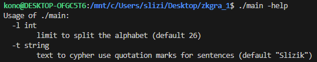
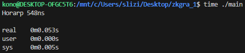
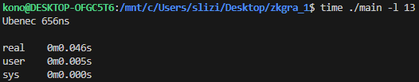

## Substitution Ciphers

For character substitution, I used a hashmap instead of an ASCII formula, which involves conversion and can be slower due to the many computational steps required. Despite increasing the program's memory usage, hashmap lookup has a time complexity of O(1). The program is designed so that the alphabet can be divided in half based on a limit value. The default limit is set to 26, resulting in mappings like A-Z, B-Y, C-X. However, if the `-l` flag is set to 13, the mapping will change to A-M, B-L, Z-N. Users can adjust this limit according to their needs. The program supports both uppercase and lowercase characters of the English alphabet.

### Example usage

### Excercise 1A

### Excercise 1B

### Sidenote
This way, the program supports both encryption and decryption. If the encrypted string is passed to the program with the proper arguments set, it will be decrypted. Further improvements could involve shuffling the alphabet according to a specific pattern, then splitting it into multiple groups and creating a hashmap from that.
