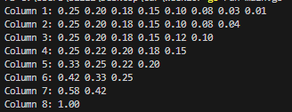
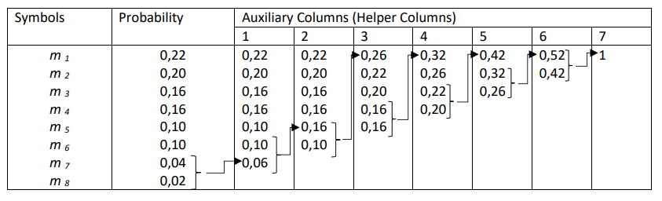

## Redundant and Non-redundant codes

### Task 1. Let a message M be formed in a binary non-redundant code that includes the symbols

Represent the message M in a redundant code, which is formed as follows: one more position in the code
symbols is added, and each symbol is determined as the sum of the values of the previous symbols (modulo
two).

```
R = (b1+b2+..bn) mod 2
so for example redundant code for A6
R6 = (1 + 0 + 1) mod 2
R6 = 0
redundant bit is appended at the end
A6 = 1010
```

```
A1=00   =>   000 
A2=01   =>   011
A3=10   =>   101
A4=11   =>   110
A5=100  =>  1001
A6=101  =>  1010
```

### Task 2. Using the example of the Huffman table, create your own table with arbitrary numbers.

| Symbols | Probability | 1    | 2    | 3    | 4    | 5    | 6    | 7    |
|---------|-------------|------|------|------|------|------|------|------|
| m1      | 0.25        | 0.25 | 0.25 | 0.25 | 0.33 | 0.42 | 0.58 | 1.00 |
| m2      | 0.20        | 0.20 | 0.20 | 0.22 | 0.25 | 0.33 | 0.42 |      |
| m3      | 0.18        | 0.18 | 0.18 | 0.20 | 0.22 | 0.25 |      |      |
| m4      | 0.15        | 0.15 | 0.15 | 0.18 | 0.20 |      |      |      |
| m5      | 0.10        | 0.10 | 0.12 | 0.15 |      |      |      |      |
| m6      | 0.08        | 0.08 | 0.10 |      |      |      |      |      |
| m7      | 0.03        | 0.04 |      |      |      |      |      |      |
| m8      | 0.01        |      |      |      |      |      |      |      |

>I wrote a simple program that automates the process. In every iteration probabilities are sorted last two numbers are added up and taken to next iteration until sum of probabilities adds up to 1.



### Task 3. Write your thoughts on where you think it is appropriate to use redundant and non-redundant codes to solve cryptographic problems. To improve the quality of confidential information transmission systems? In what cases is redundancy important for the stable operation of information transmission systems?

Redundancy is most effectively used for error detection and authentication. It is particularly valuable when transmitting confidential information to ensure its integrity and reliability. However, redundancy is more critical for maintaining stable operations rather than being inherently necessary for all information transmission systems.

### Additional material.
#### Formal definition
Encoding is the transformation of the original message into a set or sequence of code symbols that represent the message transmitted over a communication channel. According to the presence of redundancy, codes are divided into redundant and non-redundant. Nonredundant codes are characterized by the fact that they allow you to easily determine the various characters of the original message. The transition from a non-redundant code to a redundant one is carried out by adding redundant positions in code symbols, which can be obtained either by various logical operations
performed on the main information positions, or by using algorithms that link the non-redundant and redundant codes. For example, if there are message characters A1; A2; A3; A4, then they can be encoded in a binary non-redundant uniform code: A1 = 00; A2 = 01; A3=10; A4 = 11. To obtain a redundant code, you can enter one more position in the code symbols, the value of which will be determined as the sum of the values of the previous symbols modulo two A1 = 000; A2=011; A3 = 101; A4=.... A feature of such a code is that it allows you to detect any single error (an error in one of the positions of the code) that occurred during the transmission of code symbols.

#### Huffman algorithm
Huffman headed the Department of Computer Science at the Massachusetts Institute of Technology (USA). The idea of the method proposed by him is that frequently occurring characters of the original message are assigned short code characters, and rarely occurring characters are assigned longer ones. The essence of this algorithm, when using a binary code, is as follows. All characters of the original alphabet of the message source are ranked, i.e., they are written out in a column in descending order of the probabilities of their occurrence. The last two symbols (with the lowest occurrence probabilities) are combined into one auxiliary symbol, to which their total probability is assigned.

The probabilities of the symbols that did not participate in the union and the probability of the auxiliary symbol are again ranked, i.e., arranged in descending order of probabilities in an additional column and the last two symbols are combined. The process continues until we get a single auxiliary symbol with a probability equal to one. An example of encoding according to the Huffman algorithm is given in Table. one.

