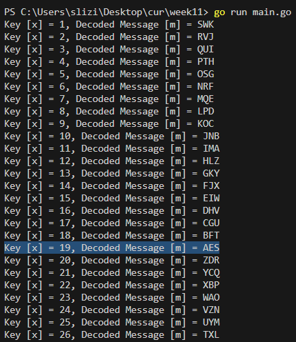

## Digital signature (1) 
### 1. To Use the RSA algorithm in order to sign and verify the notification signature with a hash value, which is `h(M) = 88`.

```
p = 17
q = 11
n = 17 * 11 = 187 
fi = (p-1) * (q-1) = 160

1 < public_key < 160
e = 7

e * d = 1 mod 160
7 * d = 1 mod 160
d = 161/7 = 23

s = h(M)^d mod n = 88^23 mod 187 = 11

s^e mod n = 11^7 mod 187 = 88
```

## Cryptoanalysis (2)
### 1. Attack on close values of p and q.
Conditions: Let's `n = p * q = 851`. An exercise: Find p and q using the rule given in the lecture.

```
n = 851
sqrt(n) = 29.17 ~ 30
y^2 = 30^2 - 851 = 49
y = 7

p = 30 + 7 = 37
q = 30 - 7 = 23

23 * 37 = 851
```

### 2. Decryption attack by iterations.
Conditions: Let `p=3, q=11; n=33; e=7, d=3;` and the message m looks like this: `m = 02`. An exercise: Calculate the cryptogram `C = ....`, Define the public key. Find the message by re-encrypting the cryptogram on the public key.

```
p=3, q=11; n=33; e=7, d=3;
public key (e, n) (7, 33)
private key (d,n) (3, 33)
m = 02

C = m^e mod n
C = 2^7 mod 33
C = 29

just to verify
m = C^d mod n 
m = 29^3 mod 33
m = 2
```

### 3. «Brute force» decryption attack.
The task: using the «brute force» procedure, reveal the numerical value of the used secret key x. Conditions: Initial information: ciphergram 202412. It is known that the first letter of the alphabet is encoded by an arbitrary number x, which is in the range from 1 to 26. This number is the secret key. All subsequent letters of the alphabet are consecutively numbered. It is also known that the ciphergram contains the name of some encryption algorithm. An exercise: Write an algorithm and a program to determine x and decode the ciphertext using the «brute force>> method.

```
let's split ciphergram 202412 to int array cipher[20, 24, 12]
we know that x is 1 to 26
try every key and try to convert cipher[i] - key to char
if the result is negative += 26
decoded message is AES
```


