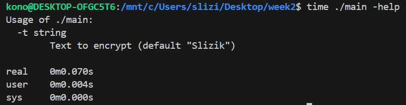
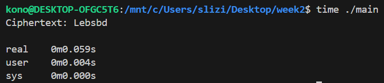
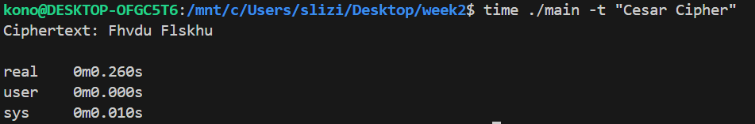

## Shift Ciphers

### Algorithm
- **Input Parsing**: The first character determines the shift K, with aA being 1, and yY being 25.
- **Character Shifting**: 
  - Uppercase (A-Z) and lowercase (a-z) letters are shifted according to K.
  - Non-alphabet characters remain unchanged.

### Example
- **Input**: "Slizik"
- **Shift Calculation**: 'S' -> 19.
- **Ciphertext**: "Lefsbv"

### Performance
The algorithm runs in O(n) time, where n is the input length, making processing time negligible.

### Limitations
- Same shift for each letter allows for pattern detection.
- Few possible shifts make brute-forcing trivial.
- Predictable input shifts based on the first letter increase vulnerability.
- If the first letter is letter `Z` or `z`, than all the letters will be shifted + 26, which means they will remain the same

### Improvements
- First, the standard alphabet can be remapped to a custom sequence.
- The implementation can utilize predetermined shift values as an array of shifts that can have both positive and negative values.

```go
shifts := []int{-3, -7, 15, 9}
shift := shifts[position % len(shifts)]
```

- When encrypting, the shifts can be applied based on the character's position in the word:

```go
if position % 2 {
  newIndexInCustomAlphabet = mod((position + oldIndexInCustomAlphabet + shift), len(customAlphabet))
} else {
  newIndexInCustomAlphabet = mod((position + oldIndexInCustomAlphabet - shift), len(customAlphabet))
}
```



