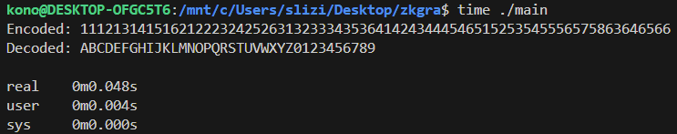
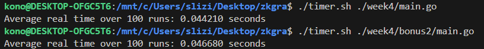
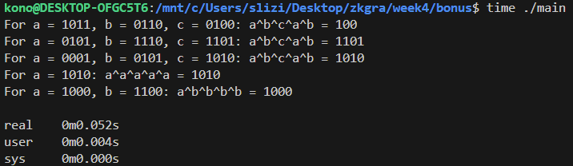

## XOR Ciphers

### Encode two messages (a and b) using the Polybius square.
The main goal of Polybius square is that we always take the row index, and column index, and encode the message based on that. For Example this Polybius square is 6x6, and includes numbers as well.

|   | 1 | 2 | 3 | 4 | 5 | 6 |
|---|---|---|---|---|---|---|
| 1 | A | B | C | D | E | F |
| 2 | G | H | I | J | K | L |
| 3 | M | N | O | P | Q | R |
| 4 | S | T | U | V | W | X |
| 5 | Y | Z | 0 | 1 | 2 | 3 |
| 6 | 4 | 5 | 6 | 7 | 8 | 9 |


Message a): ENCRYPT ME 2 DAY
```
15 32 13 36 51 34 42 31 15 55 14 11 51
```

Message b): Slizik
```
41 26 23 52 23 25
```

If we wanted to write a program to encrypt and decrypt using the Polybius square, the most straightforward approach would be to use a hashmap. For example, if you input 'A', the hashmap would return '11', and if you input '15', the hashmap would return 'E'. However, this wouldn't be the most memory-efficient method. If the Polybius square uses the alphabet and numerical values in order, we could calculate the row and column based on an ASCII formula instead.



Script `timer.sh` runs the program 100 times, and calculates average real operation time. In this image you can see that hashmap is not always the best answer, because it is slower for small inputs, but it is a lot more versatile.



### Calculate: a^b^c^a^b.
```
a = 1011, b = 0110, c = 0100; 
a = 0101, b = 1110, c = 1101; 
a = 0001, b = 0101, c = 1010.
```

| A | B | A XOR B |
|---|---|---------|
| 0 | 0 |    0    |
| 0 | 1 |    1    |
| 1 | 0 |    1    |
| 1 | 1 |    0    |

This is a tricky question, the result is always c, because x^x = 0, and x^0 = x

The program for it creates a hashmap of occurences then goes through the hashmap and performs the xor operation only on those with odd number of occurences.



### Define entropy (states are equiprobable)
The higher the `H` Entropy the better. `N` is number of states that can be generated and based on number of states and their probability we can calculate entropy. Since probability is equiprobable we don't have to take it into an account in our calculations so the formula is

$$
H = \log_2(N)
$$

1) eight states;

$$
H = \log_2​(8) = 3
$$

2) 128 states;

$$
H = \log2_​(128) = 7
$$

3) 256 states.

$$
H = \log2_​(256) = 8
$$
