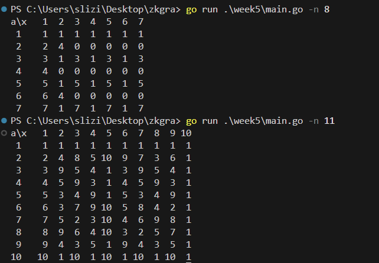
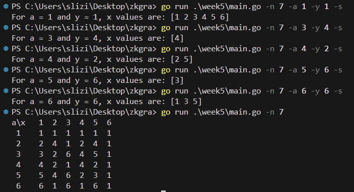

## Exercise 1
1. Calculate a common secret key in an asymmetric encryption algorithm for a
chosen functions:
The secret keys for the transmitter and receiver: 6 and 3. 

```
private key A = 6, private key B = 3
both parties agree on large coprimes p,g

2^x (mod 4)
g = 2  (generator)
p = 4  (modulator)

a = g^A (mod p) = 2^6 (mod 4) = 0  
b = g^B (mod p) = 2^3 (mod 4) = 0
public key a = 0 public key b = 0


s = b^A (mod p) = 0^6 (mod 4) = 0
s = a^B (mod p) = 0^3 (mod 4) = 0
shared secret is 0    

78^x (mod 33)
g = 78 (generator)
p = 4  (modulator)

a = g^A (mod p) = 78^6 (mod 33) = 12
b = g^B (mod p) = 78^3 (mod 33) = 12

s = b^A (mod p) = 12^6 (mod 33) = 12 
s = a^B (mod p) = 12^3 (mod 33) = 12
shared secret is 12
```

2. Answer the question: is it possible to use the function 2^-1(mod 6) as a common functions and justify your answer.

No it is not, 2 and 6 are not coprime they share common prime factor 2, and thus their modular inverse surely does not exist, and we cannot rely on using them.

## Exercise 2,3
Find prime roots modulo for the function y= a^x mod n:
* n = 8
* n = 11

Justify the answer by constructing a complete table of reflections (a,x) -> (y).

Construct a table of mappings (a,x) -> (y) for the function y= a ^ x mod 7 and determine the value of x corresponding to the combinations
```
a=1,y=1
a=3,y=4
a=4,y=2
a=5,y=6
a=6,y=6
```
Indicate which of these values of a,x are suitable for use in coding algorithms.

For excercise 2,3 I created a simple program, that visualizes the mappings table, and determines the value of x to given corresponding to the combinations. It is as simple as calculating a function for given values of x and a from 1 to n-1 during the creation of table unique values that are coprime with n are stored. As for the second part it is best to find a row of a given a and loop through values of y to find x.





The best ones to use are below because they have the fewest number of possible x values, but of course they are not optimal, it is best to use higher numbers. 

```
(a,x) -> (y)
a=3,y=4;
(3,4) -> (4)
a=5,y=6;
(5,3) -> (6)
```

## Exercise 4.
Calculate multiplicative inverse number of 34 (mod 27). 34^-1(mod 27) and describe the calculation procedure step by step.

1. are numbers coprime ?
```
represent 34 as prime numbers
2 * 17
represent 27 as prime numbers
3 * 3 * 3 
since they don't share prime numbers their greatest common denominator is 1
```

2. naive or extended euclidean algorithm 

```
34 (mod 27) 
a (mod m) 
34 (mod 27) = 7
a = 7
m = 27

a*b = 1 (mod m)
7*b = 1 (mod 27) 

b = 1..27-1
1 -> 7  (mod 27) = 7
2 -> 14 (mod 27) = 14
3 -> 21 (mod 27) = 21
4 -> 28 (mod 27) = 1
...
```

The answer is 4.