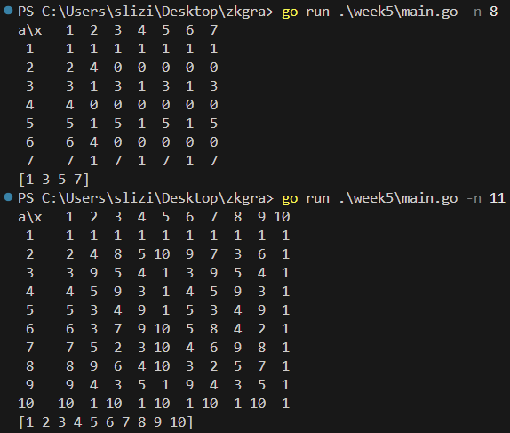

## Exercise 1
1. Calculate a common secret key in an asymmetric encryption algorithm for a
chosen functions:
The secret keys for the transmitter and receiver: 6 and 3. 

```
A = 6, B = 3
2^x(mod 4)
a = 2^6 (mod 4) = 0  
b = 2^3 (mod 4) = 0
b^A (mod 4) = 0^6 (mod 4) = 0
a^B (mod 4) = 0^3 (mod 4) = 0
The secret key will be 0    

78^x(mod 33).
a = 78 ^ 6 (mod 33) = 12
b = 78 ^ 3 (mod 33) = 12
b^A (mod 33) = 12^6 (mod 33) = 12 
a^B (mod 33) = 12^3 (mod 33) = 12
The secret key will be 12
```

2. Answer the question: is it possible to use the function 2^-1(mod 6) as a common functions and justify your answer.

No it is not, 2 and 6 are not coprime they share common prime factor 2, and their modular inverse does not exist.
```
A = 6, B = 3
2^x mod 6
a = 2^6 mod 6 = 4
b = 2^3 mod 6 = 2
The secret key cannot be calculated
```

## Exercise 2,3
Find prime roots modulo for the function y= a^x mod n:
* n = 8
* n = 11

Justify the answer by constructing a complete table of reflections (a,x) -> (y).

Construct a table of mappings (a,x) -> (y) for the function y= a ^ x mod 7 and determine the value of x corresponding to the combinations
```
a=1,y=1
a=3,y=4
a=4,y=2
a=5,y=6
a=6,y=6
```
Indicate which of these values of a,x are suitable for use in coding algorithms.

For excercise 2,3 I created a simple program, that visualizes the mappings table, and determines the value of x to given corresponding to the combinations. It is as simple as calculating a function for given values of x and a from 1 to n-1. As for the second part it is best to find a row of a given a and loop through values of y to find x.




The best ones to use are below because they have the fewest number of possible x values, but of course they are not optimal, it is best to use higher numbers. 

```
(a,x) -> (y)
a=3,y=4;
(3,4) -> (4)
a=5,y=6;
(5,3) -> (6)
```

## Exercise 4.
Calculate multiplicative inverse number of 34 (mod 27). 34^-1(mod 27) and describe the calculation procedure step by step.

1. are numbers coprime ?
```
represent 34 as prime numbers
2 * 17
represent 27 as prime numbers
3 * 3 * 3 
since they don't share prime numbers their greatest common denominator is 1
```

2. extended euclidean algorithm 

```
34 mod 27 
a mod m 
34 mod 27 = 7
a = 7
m = 27

ab = 1 mod m
7*b = 1 mod 27 
b = 1..27-1
1 -> 7 mod 27
2 -> 14 mod 27
3 -> 21 mod 27
4 -> 28 mod 27 = 1
...
```

The answer is 4.