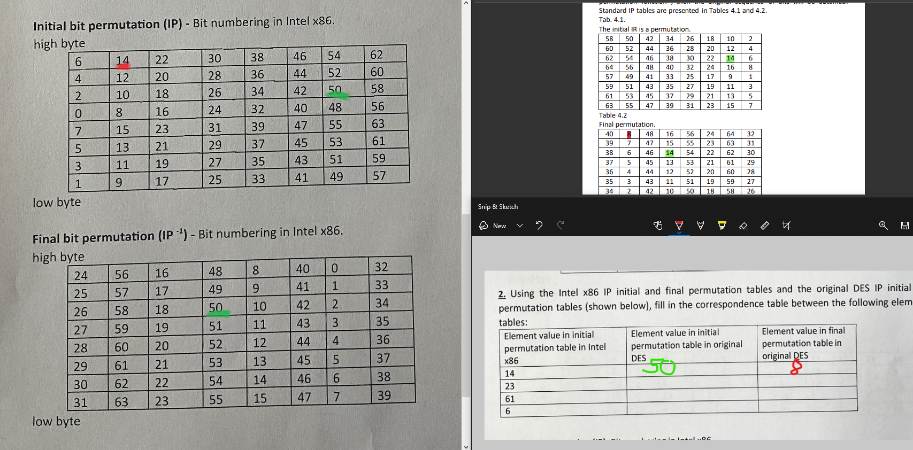

## Feistel grid

The objective of the laboratory work: modeling of coding algorithms using the main elements of the
Feistel mesh transformation.

### Exercise: 1. 
Write a program to implement a number of simplified DES operations. The information message is encoded in accordance with the general scheme of the DES algorithm.
The programs may be written in a high-level language and implement DES operations in a simplified form, but they are transferred: 
- the use of two rounds;
- no modification of keys in each round;
- the expansion operation is not converted.
#### Specification of the task:
1. As a test information notification, the vikorist notification is provided by USTASI. The English alphabet is used as part of the alphabet. | — student's official number.
Please note that the skin letter is one bit.
2. Parts Land R are designated as a subdivision of information communication throughout.
3. The mental table of the cob permutation of IP is shown below:

```
16 19 5 1 13
14 4 21 10 8
24 11 3 12 22
17 9 20 7 18
23 2 6 15 25
```


### Excercise: 2
Using the Intel x86 IP initial and final permutation tables and the original DES IP initial and final permutation tables (shown below), fill in the correspondence table between the following elements of all
tables:

| Element value in initial permutation table in Intel x86 | Element value in initial permutation table in original DES | Element value in final permutation table in original DES |
|---------------------------------------------------------|------------------------------------------------------------|----------------------------------------------------------|
| 14                                                      | 50                                                          | 8                                                        |
| 23                                                      | 41                                                          | 44                                                        |
| 61                                                      | 3                                                          | 27                                                        |
| 6                                                       | 58                                                          | 40                                                        |




### Excercise:  3. 

Calculate the result of replacing the input 6-bit number using

- the first S-box (the table was given in the lecture);
- the second S-box (given below) if the first 6-bit part of the input block has the values:Calculate the
result of using the first S-box (it was given in a lecture) if the first 6-bit part of the input block has the


* A = 011010
```
row = 00 = 0
column = 1101 = 13
S-Box-1 = 9
S-Box-2 = 0
```
* B = 001111 
```
row = 01 = 1 
column = 0111 = 7  
S-Box-1 = 1
S-Box-2 = 14
```
* C = 110110 
```
row = 10 = 2
column = 1011 = 11
S-Box-1 = 7 
S-Box-2 = 6
```
* D = 110011
```
row = 11 = 3
column = 1001 = 9
S-Box-1 = 11
S-Box-2 = 6
```