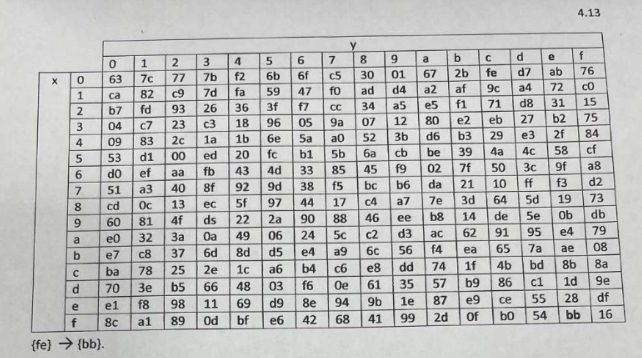
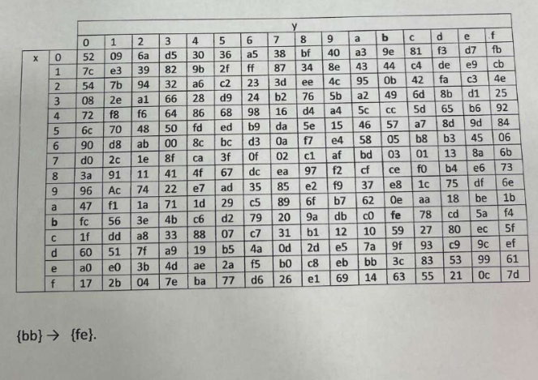
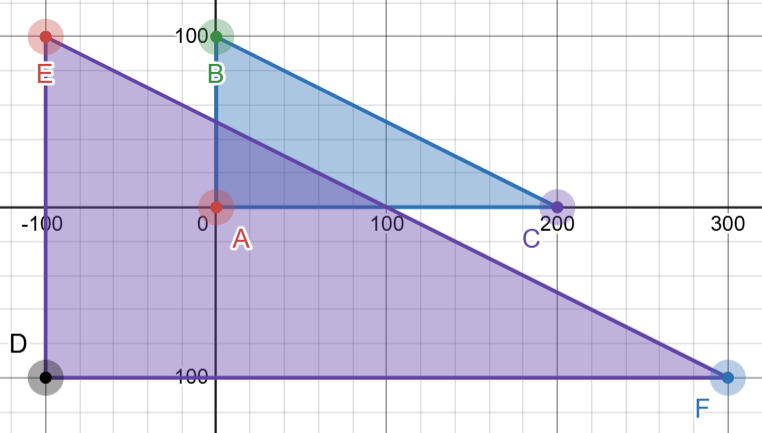

## Rijndael algorithm
### Perform SunBytes transformations.
1. Assignment condition: Encode message M using the Rijndael encryption table. Use your name as message M, writing it in hexadecimal format (HER) using the ASCII code table. Replace each byte of the data array using the Rijndael encryption table.

```
M = slizik = 73 6C 69 7A 69 6B
E = 8F 50 F9 DA F9 7F
```

2. A
In the Rijndael forward substitution table, represent the entries `01 ac 03 04 64 06 Od 10` in decimal notation.

```
01 = 7C = 124 
AC = 91 = 172 
03 = 7B = 123 
04 = F2 = 242 
64 = 43 = 67 
06 = 6F = 111 
0D = D7 = 215 
10 = CA = 202
```

Forward Substitution Table



2. B
In the Rijndael inverse permutation table, represent the elements `f1 f3 f4 f6 f8 ff 10` in decimal notation.

```
F1 = 2B = 43 
F3 = 7E = 126 
F4 = BA = 186 
F6 = D6 = 214 
F8 = E1 = 225 
FF = 7D = 125 
10 = 7C = 124
```


Inverse Substitution Table



### 3 Using the ShiftRows operation, perform the initial transformation of the model data block, assuming that each cell contains one byte of information:
|      |      |      |      |
|------|------|------|------|
| 63   | 7c   | 77   | 7b   |
| ca   | 82   | c9   | 7d   |
| b7   | fd   | 93   | 26   |
| 04   | c7   | 23   | c3   |

|      |      |      |      |
|------|------|------|------|
| 63   | 7c   | 77   | 7b   |
| 82   | c9   | 7d   | ca   |
| 93   | 26   | b7   | fd   |
| c3   | 04   | c7   | 23   |


### 4. Form a data block of the inverse transformation corresponding to the data block presented in exercise 3 and apply the ShiftRows operation to the resulting block similar to task 3.

|      |      |      |      |
|------|------|------|------|
| 63   | 7c   | 77   | 7b   |
| ca   | 82   | c9   | 7d   |
| b7   | fd   | 93   | 26   |
| 04   | c7   | 23   | c3   |


|      |      |      |      |
|------|------|------|------|
| 00   | 01   | 02   | 03   |
| 10   | 11   | 12   | 13   |
| 20   | 21   | 22   | 23   |
| 30   | 32   | 32   | 33   |

### 5. Form a table of byte order in the encryption key if the length of the encryption key is 160 bytes.

length of key / 32 = 5
```
0 5 10 15 20 25 30 35 40 45 50 55 60 65 70 75 80 85 90 95 100 105 110 115 120 125 130 135 140 145 150 155
1 6 11 16 21 26 31 36 41 46 51 56 61 66 71 76 81 86 91 96 101 106 111 116 121 126 131 136 141 146 151 156
2 7 12 17 22 27 32 37 42 47 52 57 62 67 72 77 82 87 92 97 102 107 112 117 122 127 132 137 142 147 152 157
3 8 13 18 23 28 33 38 43 48 53 58 63 68 73 78 83 88 93 98 103 108 113 118 123 128 133 138 143 148 153 158
4 9 14 19 24 29 34 39 44 49 54 59 64 69 74 79 84 89 94 99 104 109 114 119 124 129 134 139 144 149 154 159
```

### 6. Multiplication in Galois Field 5 * 7
There are a few ways how we could look at it

1. The most basic way to look at it is if we are within field limit `5 * 7 = 35`
```
5 = 101
7 = 111
  101
* 111
------
  101
 1010
10100
-----
100011 
```
2. GF(2^3) [link](https://www.youtube.com/watch?v=SKFjdAtl5Fc)

```
101  = x^2 + 1
111  = x^2 + x + 1
m(x) = x^3 + x + 1 // given for a field 2^3

(x^2 + 1) * (x^2 + x + 1) 
x^4 + x^3 + x^2 + x^2 + x + 1
x^4 + x ^3 + 2x^2 + x + 1
there cannot be 2x^2

x^4 + x^3 + x + 1 / x^3 + x + 1 = x + 1
-x^4 - x^2 - x
-------------
x^3 - x^2 + 1 
-x^3 - x - 1
-------
-x^2 - x

meaning that x^2 + x is the modulo => answer is 110 = 6
```

3. if we are in a field of 0-7 than answer is
```
5 * 7 mod 8 = 3
```

### 7. Calculate the affine transformation of triangle ABC with coordinates A (0,0), B (0,100), C (200,0) for M = 2, v = -100. Specify the coordinates of the resulting triangle and analyze the completeness of this problem.

```
(x', y') = (M * x + v, M * y + v)
A (0,0), B (0,100), C (200,0)
M = 2
v = - 100

A = (2 * 0 - 100, 2 * 0 - 100) = (-100, -100)
B = (2 * 0 - 100, 2 * 100 - 100) = (-100, 100)
C = (2*200 - 100, 2 * 0 - 100) = (300, -100)
```
Former triangle was enlarged two times in size and moved -100 on x. The integrity of the triangle was preserved. 

