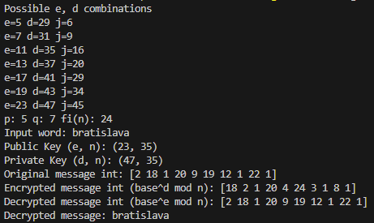
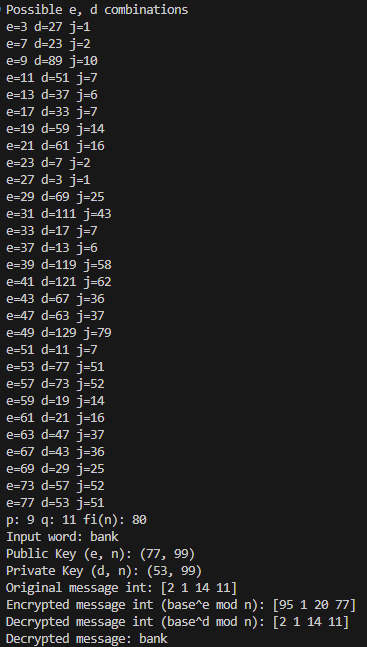

## RSA.

Objective of the work: to obtain practical skills in working with the RSA algorithm.
Task: to perform encoding and decoding operations in the RSA algorithm.

### Task 1.
1.1. Encrypt the word Bratislava using the RSA algorithm and random numbers p = 5 and q = 7. Perform encryption using a private key.

1.2. Using the received cryptogram and the public key, decode the cryptotext.

```
p = 5
q = 7
n = p x q
n = 5 x 7
n = 35

fi(n) = (p-1) x (q-1)
fi(n) = (5-1) x (7-1)
fi(n) = 4 x 6
fi(n) = 24

e random number coprime with fi(n)
1 < e < fi(n) - 1
the thing is that there is no such e that would have different d for this excercise, but I will take it nonetheless
e = 5

e x d = 1 mod fi(n)
5 x d = 1 mod 24
A^-1 = (1+24*j)/5

j = 1..24-1
...
1 -> (1 + 24*1)/5 = 5

(e,n) - public key 
(5,35)
(d,n) - private key
(5,35)

bratislava
2 18 1 20 9 19 12 1 22 1

Encryption (d,n):
2^5 mod 35 = 32
...

Decryption (e,n)
32^5 mod 35 = 2
...
```



### Task 2.

2.1. Encrypt the word BANK using the RSA algorithm and random numbers p = 9 and
q=11. Perform encryption using a public key.

Using the received cryptogram and the private key, decode the cryptotext.


```
p = 9
q = 11
n = p x q
n = 9 x 11
n = 99

fi(n) = (p-1) x (q-1)
fi(n) = (9-1) x (11-1)
fi(n) = 8 x 10
fi(n) = 80

e random number coprime with fi(n)
1 < e < fi(n) - 1
Here we take into account only e != d
e = 77

e x d = 1 mod fi(n)
77 x d = 1 mod 80
A^-1 = (1+80*j)/77

j = 1..80-1
...
1 -> (1 + 80*51)/77 = 53

(e,n) - public key 
(77,99)
(d,n) - private key
(53,99)

bank
2 1 14 11

Encryption (e,n):
2^77 mod 99 = 95
...

Decryption (d,n)
95^53 mod 99 = 2
...
```



### Task 3.

3.1 Write out all possible public keys when the numbers p = 7 and q = 11 as random numbers for the RSA algorithm.

Let's take into account only e != d cases.


3.2 Write out all possible public keys when using the numbers p = 9 and q = 11 as random numbers for the RSA Algorithm.


### Average Time
It could have been faster if I hadn't done as many prints. Still, this shows that we need to choose high prime numbers for p and q, because if they are small, the problem can be brute-forced.

