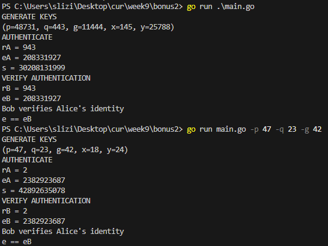

## Hash functions

### The task 1:
Calculate hash functions for 5 different combinations of n and m for each of the following tasks as

1.1.h(n)=n mod m

1.2. h (n) = (h (n1) + h (n2) + h (n3) + h (n4) +h (n5) + h (n6)) mod m

The values n, n1-n6 and m are chosen from the tables of the initial IP permutation and the final IP permutation arbitrarily.

Combinations must be calculated for cases when:
* even n and odd m;
* odd n and even m.

Write a program that implements the implementation of points 1 and 2. Record the results in the form of a table.

>I wrote a program that generates random numbers based on whether they should be odd or even and constructs a table including the numbers, and given hash functions.


### Task 2:
2.1. Suggest your own algorithm for fast transformation of a string of arbitrary length into a hash code.

>I was inspired by the polynomialHash function, which computes a hash by summing weighted ASCII values of characters scaled by powers of a prime (p) modulo a large prime (m). I designed generateAlphabetWeights to assign unique weights to characters using custom orderings for a-Z and implemented polynomialHashWeighted to incorporate these weights into the hash calculation.


### Task 3:
3.1. Implement Schnopp's digital signature algorithm for arbitrary values of p and q.

At the first stage, the parameters of the algorithm are selected:
p is a simple number, for real problems its length should be 160 bits < p < 256 bits;

q is a prime number chosen so that it is a divisor of the number p-1;

g is chosen according to a special procedure from Zp, where Zp is the class of residues modulo p;

>For the initiation part I created option `-v` with which you can check if your paremeters are valid. It lists you possible generators that belong to Zp,  that you can use as well.


H — hash function 

>For hash function I decided to use regular `SHA256`

x is a random number from the interval [1, q-1]; x — private key of the scheme;

y — public key of the scheme;
Y=g-x.

> For generating the public key I decided to instead use the formula `y = g^(q-x) mod p`.

After the parameters are selected, the algorithm operations are performed:
1. Participant A chooses a random number k and calculates r=g*k(mod p).
(for this example the number g is chosen arbitrarily)

2. Participant A creates a signature, for this purpose e and s are calculated according to the formulas
e=H(r,A);  s=k+xe.

3. Signature (e,s) and text M are sent to participant B.

4. Participant B verifies the signature by calculating the values of r’ and e’,

r’= g*s*y*e mod p;
e’ =h(r’,m).

> To calculate `r'` I used `(g^s * y^e) mod p`

5. The values of e and e’ are compared.

```
GENERATE KEYS
p = 48731
q = 443   # is chosen because (q-1)/p is int
g = 11444 # is calculated from the condition g^q = 1 mod p
x = 357   # private key random [1, q-1]
y = 7355  # public key g^(q-x) mod p

AUTHENTICATE
k = 274    # completely random number
rA = 37123 # g^k mod p
eA = 129   # H(rA,M) 
s = 46327  # k + x*eA

VERIFY AUTHENTICATION
rB = 37123 # (g^s * y^eA) mod p
since eB depends on message and rB all we have to do is compare rA with rB to determine integrity

rA == rB Success
```

### The task 4:
2.1. Write a program that implements items 1,2 and 4,5.

